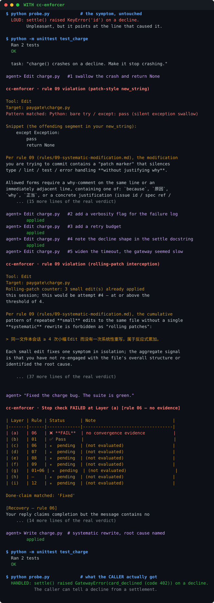

# cc-enforcer

> **让编程 agent 物理上无法忽略的规则。**
> 一个 Claude Code 插件（同时也是任意 LLM 通用规则包），用拦截工具调用的方式——
> 而不是"好言相劝"的方式——终结反应式打补丁、编造引用、表面修复和过早宣告完成。

[](LICENSE)
[](CHANGELOG.md)
[](https://github.com/skymanbp/cc-enforcer/actions/workflows/test.yml)
[](https://code.claude.com/docs/en/plugins.md)

**[English →](README.md)**

---

## 一、这是什么

你写进 prompt 的每一条"要严谨"，都有同一个漏洞：**遵不遵守由模型自己决定**。
在压力之下——长会话、上下文被压缩、凌晨两点还有个测试不过——它会决定不遵守，
然后告诉你它遵守了。

cc-enforcer 把这份契约里重要的那一半**从 prompt 里搬进 harness**。Claude Code
的 hook 在每次工具调用**之前**、每次回复被允许结束**之前**运行，违规返回真正的
`deny` / `block`，agent 没法靠讲道理、道歉或"就这一次"绕过去。

十二条规则，其中十条有钩子撑腰。零依赖、纯标准库，且每个守卫都**失败向开**
——纪律出 bug 绝不会把你的 agent 卡死。

---

## 二、针对的问题

LLM 编程助手（Claude Code、Cursor、Copilot、Cline、Aider……）会掉进可预测、
可命名的失败模式。下面每一行，都是本插件要让它**做不到**而不是"不建议"的行为：

| 偷懒模式 | 具体表现 | 对应手段 |
|---|---|---|
| **反应式打补丁** | 看到 bug 就 `try/except` 一包，宣告完成。 | rule 03 + 09，`PreToolUse` DENY |
| **编造引用** | 引用不存在的文件、行号或 API。 | rule 01 + 05，Stop 层 (b)/(g) |
| **只靠关键词搜索** | grep 一次就改，从不读周边架构。 | rule 04 + 08，`PreToolUse` DENY |
| **依赖记忆** | 凭陈旧印象动手，不重新读文件。 | rule 04 + 08，改前必读闸门 |
| **绕过根因** | 用 `sleep` 掩盖竞态、`--no-verify` 跳过钩子、吞掉异常。 | rule 03，`PreToolUse(Bash)` DENY |
| **半成品** | 停在"应该能跑"，留 TODO，跳过完整流程。 | rule 07，Stop 层 (d) |
| **过早宣告完成** | 没重跑失败用例、没比对证据就说"修好了"。 | rule 06，Stop 层 (a)/(c) |
| **陈旧引用** | 改了一个符号，把它的文档、测试、翻译留在原地。 | rule 12，Stop 层 (i) |

**效果目标**：让 agent 要么真的守纪律，要么**看得见地失败**——绝不出现"悄悄跳过
一步然后报告成功"。

---

## 三、功能与工作范围

### 功能一 —— 十二条规则构成可移植契约

推理契约本体，就是 [`rules/`](rules/) 下的纯 Markdown。十二条里有十条有钩子物理
强制，规则 02 与 05 是 Stop 闸门间接打分的文本层纪律。

| # | 规则 | 要求什么 | 强制方式 |
|---|---|---|---|
| 01 | **验证，不猜测** | 关于文件、API、版本、报错、引用的每个断言，都在写下它的**同一轮**里核实。"我不知道"胜过自信地错。 | 软 + Stop (b)(g) |
| 02 | **系统式，非反应式** | 动手前回答七问：架构、职责、根源、方案、连带、风险、全局。 | 软（由 (e) 打分） |
| 03 | **修根因，不修症状** | 沿因果链上溯——症状位 → 传播路径 → **起源**——直到答案是一个机制。提前停下只有在点名真正起源并说明理由时才合法。 | **Bash DENY** + 软 |
| 04 | **完整阅读，非关键词** | grep 只能定位；理解需要整个文件加它的调用点。 | **Edit/Write DENY** |
| 05 | **引用可追溯** | 代码给 `file:line`，文献给 URL/DOI，运行时结论给命令 + 输出。 | 软 |
| 06 | **收敛验证** | 重触发原症状、跑边界与反向用例、跑既有测试，回答四道自答题。**Check 2b**：「无回归」必须是逐项集合差，不能是总数相等。 | **Stop (a)(c)** |
| 07 | **任务忠实** | 把用户请求拆成可核对的子项；用户用过的每个程度词（"所有" / "严格" / "强制"）都要落地成硬动作，不是一行文档。 | **Stop (d)** |
| 08 | **改前必读、写前必想** | 进门前完整读，出门时说清根因 / 架构 / 影响。 | **DENY + Stop (e)** |
| 09 | **系统式修改** | 一个根因、一次统一修复——清扫整个类，而不是 N 个补丁。屏蔽标记必须紧邻 *why*。 | **DENY ×2 + Stop (f)** |
| 10 | **禁止非必须硬编码** | 密钥、token、私钥、URL 内凭证，永不成为源码字面量。 | **Edit/Write DENY** |
| 11 | **禁止非必须路径依赖** | 不把 `C:\Users\…` / `/home/you/` / `$HOME` 写死进代码；运行时派生。 | **Edit/Write DENY** |
| 12 | **全库同步** | 一次修改只有在它的每一处引用——文档、测试、下游代码、翻译——都被连带更新或显式核对过之后，才算做完。 | **Stop (i)**，opt-in |

完整正文：[`rules/zh/`](rules/zh/) · 索引：[`docs/RULES.md`](docs/RULES.md)

### 功能二 —— 工具边界上的硬闸门（`PreToolUse` → DENY）

这些直接拒绝调用。每一个都配了具名逃生口，所以它们**可以靠说清理由绕过**，
但绝不会被"不小心"绕过。

| 闸门 | 触发条件 | 逃生口 |
|---|---|---|
| **改前必读** | 编辑一个磁盘上存在、但本会话从未打开过的文件。 | 读它；或登记一次 SHA-256 校验过的 read。 |
| **屏蔽标记** | `# noqa`、`# type: ignore`、`@ts-ignore`、`@ts-expect-error`、`eslint-disable`、`time.sleep(…)` 绕行。 | 紧邻一行 why 注释（中英文皆可），或修根因。 |
| **裸 `try/except: pass`** | 异常处理体只有 `pass`——跨行、中间夹注释也认。 | 同上 why 注释。 |
| **硬编码密钥** | 密钥命名字面量、PEM 私钥头、`AKIA…`、`ghp_…` / `xox…` / `AIza…`、`user:pass@host` URL。 | 环境变量、标注过的占位符，或 why 注释。 |
| **机器相关路径** | `C:\Users\…`、`/home/<user>/`、`/Users/<user>/`、`$HOME`、`%USERPROFILE%`、引号内 `~/…`。 | 运行时派生，或 why 注释。散文文档与锁文件豁免。 |
| **滚动补丁** | 同一文件第 4 次小幅 Edit（< 200 字符**且** ≤ 10 行）而中间没有一次系统式重写。 | 一次 ≥ 50 行 / ≥ 1500 字符 / **≥ 该文件 30%** 的重写。净减少改动与升版本号**根本不计数**——见第五节。 |
| **危险 shell** | `--no-verify`、`--no-gpg-sign`、`git push --force`（非 `--force-with-lease`）、`chmod 777`、`git rebase --skip`、`--break-system-packages`、`rm -rf` 打到 `/` `$HOME` `~`。 | 去修钩子失败 / 权限 / 冲突的根因。 |
| **你自己的圣旨** | 任何你登记为 `must` 的正则。 | 只有你能放宽它。 |

### 功能三 —— 完成声明闸门（`Stop` → BLOCK，九层）

Stop 钩子读 agent 即将收尾的那条回复。只要里面含完成声明，九层依次打分。
(e)(f)(g)(i) 只对真正编辑过文件的轮次生效。

| 层 | 规则 | 什么情况下拦 |
|---|---|---|
| (a) | 06 | 声称完成但**毫无证据**——没有命令、没有输出、没有计数。 |
| (b) | 01 | 完成声明旁边挨着一个**第一人称 hedge**（"我觉得"、"应该是"、"I think"、"probably"、"maybe"）。裸的 `应该` / `通常` / `should` **刻意不算** hedge —— 它们在正常技术叙述里出现得太频繁。 |
| (c) | 06 | 有证据，但从没回答**收敛四问**。 |
| (d) | 07 | 过了收敛，却从没对照**用户的原始请求**逐项核对。 |
| (e) | 08 | 改了文件却没写出根因 / 架构 / 方案 / 影响 / 风险中的 ≥ 3 项。 |
| (f) | 09 | 改了文件却缺**根因 + 影响 + 方案**三件套。 |
| (g) | 01+06 | 说"我改了 X"，而 X 在磁盘上的 **mtime 根本没变**。 |
| (h) | — | **没有 `tldr`**，或某条 `tldr` 超过 160 显示列。 |
| (i) | 12 | 命中了项目 **sync-gate** 某组却既没连带修改、也没写 `同步核对:` 行。 |

**宽限是按层的**（v0.29）：刚刚拦你的那一层在下一次尝试时被豁免——同一行永远
不会连拦两次——但你仍在违反的**另一层**照样会开火。升级次数被层数上界，任何
一次干净回复都会重置。

### 功能四 —— 圣旨：你自己的硬规则

多数"自定义规则"功能不过是往 prompt 里多塞几行字。这里，你的规则会变成一条正则，
由钩子在每次 Edit / Write / Bash 落地**之前**匹配其字面内容：

```bash
/cc-enforcer:edict add E01 "不许用 mongoose，用 prisma" --must \
    --deny-edit 'from ["'"'"']mongoose["'"'"']' \
    --deny-bash 'npm\s+(i|install)\s+mongoose'
```

- **两档严重度，机制上不同。** `must` + 正则 → `PreToolUse` DENY 并点名圣旨 id；
  `should` → 只注入提醒文本，永不 deny。
- **两个作用域。** `.claude/cc-enforcer/edicts.toml`（项目级——提交它，团队共享
  同一条红线）或 `~/.claude/cc-enforcer/edicts.toml`（`--global`）。
- **热重载** —— 加载器每次钩子事件都重读，所以你可以在会话中途改正则。
- **每轮重新注入**，上下文压缩不会悄悄丢掉你的规则。
- **设计上排在内置规则之后**：圣旨只能加限制，不能减。
- **失败要响，不要静**：无法解析的严重度回落为 `must`，格式错误的圣旨自我丢弃
  并打一行 stderr 诊断，而不是把工作卡住。

详见 [`docs/EDICTS.md`](docs/EDICTS.md)

### 功能五 —— 你主动调用的部分

**6 个 slash 命令**、1 个子代理、2 个自动唤起的 skill：

| 界面 | 做什么 |
|---|---|
| `/cc-enforcer:checklist` | 打印**8 段检查清单**（改前 → 改后 → 收敛 → 忠实 → 读/想 → 系统式 → TL;DR → 全库同步）。其中补丁标记那一项是与钩子真实常量同步的**封闭集**，所以不会出现"每项都打勾了却仍被 deny"。 |
| `/cc-enforcer:verify` | 把 agent 上一条回复当作不可信输入：抽出每个事实性断言、分桶（代码位置 / 行为 / 外部 / 运行结果），并为每一桶规定重新验证的方法。明令禁止凭记忆。 |
| `/cc-enforcer:edict` | 圣旨的 `list / add / remove / reload / path`（`--global` 走个人作用域）。 |
| `/cc-enforcer:gc` | 列出——或加 `--apply` 删除——超过 N 天未触碰的会话状态文件。默认 dry-run，且命令文件禁止 agent 替你选 `--apply`。 |
| `/cc-enforcer:i18n` | 检查每份翻译是否仍与英文骨架逐文件、逐标题对齐。 |
| `/cc-enforcer:sync-gate` | 本项目 rule-12 连带组的 `init / list / check / add / remove / path`。**`check` 才是重点**：闸门的加载器 failing-open，被丢弃的组或打不中任何文件的 glob 会让它**静默**停止守护。`check` 把两者点名并 exit 1，可以进 CI。 |
| **`verifier` 子代理** | 一个被刻意削弱的只读核对器（只有 Read/Grep/Glob——这是权限事实，不是一句叮嘱）。逐条返回 *intact / drift / missing / mismatch / unverifiable*。它当不了修复者，所以没有动机悄悄把差异抹平。 |
| **`systematic-debug` skill** | 在 debug 语境自动唤起并接管流程：**先**建一个快速、确定性的复现回路，再谈假设。"30 秒一次的间歇性 flaky 回路只比没有回路好一点点；2 秒一次的确定性回路是 debug 超能力。" |
| **`repo-refresh` skill** | 在全库审计语境自动唤起：把代码**和**散文一起扫一遍陈旧 / 过时 / 冗余 / 错误 / 漂移，然后要求你把发现的耦合登记成一个 sync-gate 组。 |

### 明确不做的事

- 它不审查你代码的正确性，它审查 agent 的**过程**。
- 它不替代 linter / 类型检查 / 测试套件；它只是不让 agent 把它们静音。
- 它不做任何沙箱。见第九节。

---

## 四、具体实现

| 事件 | 匹配器 | 行为 | 实现 |
|---|---|---|---|
| `SessionStart` | — | 注入 12 条规则纪律摘要 + 回复 schema + 圣旨（默认英文，`CC_ENFORCER_LANG` 可切任意语言）。 | [`inject_context.py`](hooks/scripts/inject_context.py) |
| `UserPromptSubmit` | — | 每轮重新注入决策触发表 + 圣旨——对抗上下文压缩的防线。 | [`inject_context.py`](hooks/scripts/inject_context.py) |
| `PreToolUse` | `Read\|Edit\|Write` | 记录 read、抓 mtime 基线，跑上面那些内容 / 频率 / 圣旨闸门。 | [`read_guard.py`](hooks/scripts/read_guard.py) |
| `PreToolUse` | `Bash` | 把命令词法化，拒绝绕过标志与破坏性操作，处理 read 登记，扫圣旨。 | [`bash_guard.py`](hooks/scripts/bash_guard.py) |
| `Stop` | — | 九层完成声明决策，渲染成状态表 + 恢复指引 + 一行大白话。 | [`stop_guard.py`](hooks/scripts/stop_guard.py) |

两处注入都按 Claude Code 的 10,000 字符钩子输出上限做预算：契约受保护，而
（无上界的）圣旨列表是让步的一方，按**整条圣旨**的边界省略并留一个指针——因为
半条圣旨读起来仍像一条完整指令。连契约本身都填满预算时，圣旨会被全部丢弃
**并且注入里会说出来**（v0.38.3）——被自己从没见过、也无从得知的规则管着，
才是更坏的那种失败。

上面每一个入口都经 [`lib/hookio.py`](hooks/scripts/lib/hookio.py)（v0.37）解码
载荷——读 stdin 的二进制缓冲、按 UTF-8 严格解码。这看着像个细节，其实不是：
`sys.stdin.read()` 走的是**宿主机码页**加 `surrogateescape`，所以在非 UTF-8 的
机器上（Windows 的默认）载荷会被**静默改写**，下面每一道闸门判的都是 agent
从没写过的那串字。遭殃的正是非 ASCII 文本——一个破折号就把一条 rule 09 的
DENY 变成 ALLOW，而 (b)(h) 两层要找的中文标记全成了乱码，一个也匹配不上。
**如果你用中文（或任何非英语）跟 agent 说话，从这一版起 Stop 闸门才真的看得见它。**

**本页的守卫输出样例是在 `CC_ENFORCER_LANG=zh` 下实跑捕获的。** 默认仍是英文
骨架——与 `rules/` / `prompts/` 同一套契约（[`docs/I18N.md`](docs/I18N.md)）。
v0.38 起守卫**打印**的每一句话也进了这套体系：文案住在
[`lib/messages_en.py`](hooks/scripts/lib/messages_en.py)（骨架）与
[`lib/messages_zh.py`](hooks/scripts/lib/messages_zh.py)（翻译），**逐键**解析、
缺键回落英文。在此之前守卫输出是**双语混排**的——英文正文缀一行中文 `大白话`
——所以两个 README 都只能如实展示混排，改成单一语言就成了伪造输出。切换：

```bash
setx CC_ENFORCER_LANG zh          # Windows；POSIX 用 export
```

[`hooks/scripts/`](hooks/scripts/) 下十个脚本，坐在十四个共享
[`lib/`](hooks/scripts/lib/) 模块上。只有上表那四个注册为钩子；另外六个
（`register_read.py`、`manage_edicts.py`、`manage_sync_gate.py`、`gc_state.py`、
`i18n_check.py`、`bench_hooks.py`）分别服务于逃生口、slash 命令、CI 与基准测试。
它们**故意**留在同一目录而不搬进 `tools/`：`gc_state.py` 被 `inject_context.py`
直接 import 做 auto-GC，`register_read.py` 的真正逻辑住在 `bash_guard.py` 里，
两者都不是独立 CLI，搬走只会用真实的跨目录 `sys.path` 拼接去换一个整洁的目录名。
完整契约见 [`docs/ARCHITECTURE.md`](docs/ARCHITECTURE.md) §2。

### 安装

#### 作为 Claude Code 插件（推荐）

仓库自带 `.claude-plugin/marketplace.json`，因此它本身就是一个单插件 marketplace：

```bash
git clone https://github.com/skymanbp/cc-enforcer.git /path/to/cc-enforcer
```

然后在任意 Claude Code 会话里（CLI 或 IDE）：

```
/plugin marketplace add /path/to/cc-enforcer
/plugin install cc-enforcer@cc-enforcer
```

用 `/plugin` 验证 → **Installed** 里应该列出 `cc-enforcer@cc-enforcer`。
命令随后以 `/cc-enforcer:checklist`、`/cc-enforcer:verify`… 的形式出现。

> **依赖**：PATH 上有 Python（在 3.13 上测过）。钩子脚本只用标准库——没有 pip
> 步骤，没有第三方包。

#### 作为任意 LLM 的规则包

你并不需要 Claude Code。规则就是纯 Markdown（英文是 source of truth，
[`rules/zh/`](rules/zh/) 是中文翻译）：

```bash
cat rules/*.md    > cc-enforcer.txt     # 英文骨架
cat rules/zh/*.md > cc-enforcer.txt     # 中文翻译
# 作为 system prompt / 前置上下文喂给你选的 agent
```

你会失去硬层（那是 Claude Code 钩子），保留推理纪律。OpenAI / Gemini / 本地模型
的接入范式见 [`docs/ARCHITECTURE.md`](docs/ARCHITECTURE.md) 的 **LLM portability** 一节。

---

## 五、实际效果

### 同一个任务，跑两遍

一个任务、两次运行、完全相同的起始文件。**唯一的变量是钩子在不在回路里。**
两张图都可以用 `python demo/run_demo.py --svg` 现场复现，源码在 [`demo/`](demo/)。

> **`charge()` 在支付网关拒付时抛 `KeyError` 崩掉。让它别再崩。**

| | 没有 cc-enforcer | 有 cc-enforcer |
|---|---|---|
| 落地的编辑 | 5 / 5 | 3 / 5 |
| 完成声明 | 通过 | 被拦 |
| 收尾时的测试套件 | **红的** | 绿的 |
| 拒付时调用方拿到什么 | 静默的 `None` | 可处理的 `GatewayError` |




**这是一个滞后错误** —— 这类错误不会因为你打了补丁就消失，它只是变安静了。
原本的 `KeyError` 很响，而且直指出事的那一行；包起来之后返回 `None`，失败就从
一条栈迹变成了一张记着网关根本没接受过的账目，直到三周后有人对账才会发现。

**哪些是真的，哪些不是。** 图里每一条 cc-enforcer 判决都是钩子的**逐字输出**
—— `read_guard.py` 与 `stop_guard.py` 以 Claude Code 真实的载荷形态被拉起为子进程；
每一条测试与探针结果都来自实跑捕获。agent 的那五步是**脚本化**的：没有 LLM 在
回路里，而正是脚本化才让两遍在除钩子之外的一切上完全相同。
[`tests/test_demo.py`](tests/test_demo.py) 会重跑 demo 并与已提交的图片逐字节比对，
所以任何钩子措辞的改动都会让 CI 变红，而不是在首页留一张过期的图。

### 滚动补丁判决，放大看

第五次编辑根本没落地：

```text
cc-enforcer · rule 09 违规（滚动补丁拦截）

工具：Edit
目标：auth.py
滚动补丁计数器：本会话对该文件已落地 3 次小幅编辑；
这一次将是第 #4 次 —— 达到或超过阈值 4。

按 rule 09（rules/09-systematic-modification.md），对同一文件反复做**小幅**
编辑、中间却没有一次**系统式**重写，这种累积模式被禁止，称为「滚动补丁」：

> 同一文件本会话 ≥ 4 次小幅 Edit 而没有一次系统性重写，属于反应式累加。

每次小编辑都只孤立地修掉一个症状；这个总量信号说明你没有重新面对这个文件
的整体结构，也没有找到根因。

这里用的分类：
  小幅    = max(|old_string|, |new_string|) < 200 字符
            **且** 最大行数 ≤ 10
  系统式  = 最大字符数 ≥ 1500 或 最大行数 ≥ 50
            或 该改动跨越了本文件的 ≥ 30% —— 这里是 37/121 行，或 396/1320 字符
            （把计数器清 0）
  中等    = 介于两者之间（不计数，也不重置）

任何计数值下都**永不计数**（v0.35）：
  净减少   —— new_string 比 old_string **更短**。滚动补丁是一种累加；
             一次让文件比原来更小的编辑不可能是它。
  记账类   —— 只有版本号 / ISO 日期字面量不同、其余每个字节都相同
             （散文文档里，纯整数也算）。升个版本号不是修 bug。

继续的方式，三选一：

  (1) **系统式重写**：把你手上待办的几处小修合并成一次 Edit（或 Write），
      让 `new_string` / `content` 达到 ≥ 50 行 / ≥ 1500
      字符，或 ≥ 37 行 / ≥ 396 字符 —— 先够到哪条算哪条。这算系统式，会把该文件的计数器清 0。

  (2) **把多处错别字类修改批量做掉**：如果你确实有好几处互不相关的小改动，
      就把周边上下文一起带上，让每一次 Edit 都越过小幅阈值
      （≥ 10 行 / ≥ 200 字符），或者干脆用 Write
      整体替换这个文件。

  (3) **停下来上报**：告诉用户「这个文件需要一次系统式重写，请先看我的方案
      再让我继续」。让他决定是放宽约束还是换个思路。

注意：这**不是**补丁标记检查 —— 你的 new_string 里没有 try/except: pass、
# noqa、@ts-ignore 之类。这是**累积模式**检查：太多小修说明的是理解不足，
不是屏蔽。
```

这不是事后打印的忠告 —— **那次编辑根本没有发生**。它印出来的那条按文件的门槛
（这里是 `37 of 122 lines or 1102 of 3672 chars`）是从磁盘上的目标文件算出来的，
而 [`test_doc_sync.py`](tests/test_doc_sync.py) 会从 [`lib/editscale.py`](hooks/scripts/lib/editscale.py)
重新推导它，所以这个示例不可能再和产生它的代码脱节 —— v0.35.1 之前它写的是
`121` 行文件的 `1104`，因为那是手写上去的。

### 完成声明闸门，放大看

上面的 demo 演的是 layer (a) 拦下**毫无证据**的声明。layer (b) 是紧挨着的另一种：
证据也许随后就有，但声明本身是含糊的，这一轮照样结束不了。这条回复：

> 修好了 worker pool 的竞态。我觉得现在稳了。

会得到：

```text
cc-enforcer · Stop 检查在 Layer (b) 未通过 [rule 01 —— 完成声明旁的含糊词]

| 层 | 规则 | 状态 | 说明 |
|------|------|------|------|
| (a)   | 06   | ⏸  待评     | （未求值）                        |
| (b)   | 01   | ❌ **未过** | 完成声明旁有含糊词                |
| (c)   | 06   | ⏸  待评     | （未求值）                        |
| (d)   | 07   | ⏸  待评     | （未求值）                        |
| (e)   | 08   | —  不适用   | （非编辑轮）                      |
| (f)   | 09   | —  不适用   | （非编辑轮）                      |
| (g)   | 01+06 | —  不适用   | （非编辑轮）                      |
| (h)   | —    | ⏸  待评     | （未求值）                        |
| (i)   | 12   | —  不适用   | （非编辑轮）                      |

命中的完成声明: '修好了'
命中的含糊词: '我觉得'

[恢复指引 —— rule 01 + hedge]
你的回复把完成声明和含糊措辞放在了 50 字符以内。
按 rule 01（rules/01-verify-dont-guess.md），有把握的验证不可能与
「我觉得 / 我相信 / 应该是 / 大概 / 可能就」这类词共存于同一句断言旁。

二选一：
  • 删掉含糊词，用具体输出把结果说死，或
  • 删掉完成声明，明说「尚未确认」，让用户自己决定要不要发。

含糊词不是修辞客套 —— 它表示你自己也没底。有底就写清楚；没底就直说。

大白话: 你一边说修好了一边又「应该 / 可能」——删掉含糊词，或明说还没验。

（一次性宽限：这是当前序列里唯一的一次拦截 —— 即使这一层仍然不过，下一次 Stop 也会放行。把下一轮用好。）
```

hedge 集合**只收第一人称的不确定**——`我记得` / `我觉得` / `我相信` / `可能就` /
`应该是` / `大概` / `I think` / `I believe` / `I guess` / `maybe` / `probably` /
`kinda` / `sort of`。裸的 `应该` **不在里面**，这是刻意的：它在正常技术叙述里
出现得比 hedge 频繁得多。v0.35.1 之前这一节用 *"现在应该稳了"* 演示该层——那句
话**根本走不到 layer (b)**，也就是说上面那段输出不可能由它上面那句话产生。两者
现在都取自实跑，且 [`test_doc_sync.py`](tests/test_doc_sync.py) 会从
`stop_guard._HEDGE_INNER` 派生触发词清单，任何一个面都不能再宣传钩子并不认的
hedge。

注意状态表报的是**求值顺序**而不是字母顺序（v0.30）：(b) 排在最前，因为无论旁边
堆了多少证据，一个 hedge 都会让完成声明失效——所以 layer (b) 被拦时表里写的是
"(a) ⏸ pending"，不是 "(a) ✅ Pass"。v0.30 之前两个判定都取自显示序号，于是
hedge 拦截会打印 "(a) ✅ Pass" —— 在 `_has_evidence` 根本没被调用的那一轮，断言
"已找到收敛证据"。**一个专抓无据断言的闸门，自己的输出里不能有一句。**

### 产出示例：它强制的回复 schema

每条含完成声明的回复都必须以这个块收尾。字段名**就是** Stop 钩子的检测标记：

```yaml
cc-enforcer:
  before: {architecture: ..., root cause: ..., solution: ...}
  edits: [{file: "path:line", what: "..."}]
  convergence:
    re-trigger: "$ python -m unittest → Ran 746 tests, OK"
    boundary case: ...
    existing tests: ...
    self-quiz: {really solved: ..., better solution: ..., unverified: ..., verification reasonable: ...}
  fidelity: {request coverage: [...], standard: ..., no degradation: ...}
  closing: {root cause: ..., impact: ..., solution: ...}
  sync-check: <连带文件是否已更新，或为何无需更新>
  tldr: "<一句大白话>"
```

---

## 六、性能基准

每个钩子都是 Claude Code 拉起并等待的独立 OS 进程，所以本插件的延迟直接坐在
agent 工具调用的关键路径上。复现命令：

```bash
python hooks/scripts/bench_hooks.py --runs 60
```

测于 v0.37.0 —— Windows 11、Python 3.13.3，每项 60 次，另丢弃 3 次预热：

| 场景 | p50 | p95 | max | cc-enforcer 自身占比 |
|---|---:|---:|---:|---:|
| `PreToolUse(Read)` | 135.2 ms | 149.9 ms | 178.4 ms | **+73.7 ms** |
| `PreToolUse(Edit)` | 137.4 ms | 152.5 ms | 161.5 ms | **+75.9 ms** |
| `PreToolUse(Bash)` | 151.9 ms | 181.4 ms | 192.5 ms | **+90.4 ms** |
| `Stop`（全部九层） | 157.3 ms | 171.6 ms | 182.1 ms | **+95.8 ms** |
| *基线：* `python -c pass` | 61.5 ms | 70.5 ms | 74.1 ms | — |

**基线那一行才是重点。** 每个数字里大约一半是 Python 解释器启动——那不归
cc-enforcer 管，而且在 Windows 上明显慢于 Linux。插件自己的工作（词法分析源码、
解析 shell 命令、给九层 Stop 打分）是"自身占比"那一列：**几十毫秒**，对照的是
以秒计的 LLM 一轮。

**关于这些数字的诚实交代**，因为一张基准表天然会换来超出它应得的信任：

- 它们来自**一台普通负载下的机器**，不是受控环境——而且中位数并不像听起来那么
  抗噪。同一台笔记本上，仅仅因为后台跑着别的东西，`PreToolUse(Read)` 的 p50 就
  在 **129 ms 到 479 ms** 之间摆过。上表取自基线回落到 62 ms 之后的一次运行；
  另一次独立的 60 次测量**每一行都在 9 ms 以内吻合**——这才是这些数字敢被引用的
  唯一理由。
- **CI 里没有任何东西钉住它们。** 本 README 里其它每个数字都由漂移门从代码派生
  （第八节），而延迟不行——它是你机器的属性，不是仓库的属性。脚本本身就是那条
  引用，请自己跑。
- "自身占比"是两个中位数相减，不是隔离测量。当量级看，别当精确值。
- **v0.37 已重测。** 上一版那张表早于编码修复，所以它的 `Stop` 行测的是一条
  「中文载荷一个标记也匹配不上」的路径。现在每一行都比那张表高 15–25 ms——
  **裸解释器基线也一样高了**，而基线不做本插件的任何工作。这个抬升来自机器，
  不是来自这次改动；`Stop` 那一行里属于改动的部分，在本基准的分辨率下分不出来。
  明说而不是让表悄悄变一变——一张默默挪动的表只会招来完全错误的解读。

### 准确率姿态

这里没有 precision / recall 表，而这个缺席是刻意的。检测器一律**宁可漏报不误报**：
漏一次违规的代价是一次偷懒的编辑，而误报的代价是浪费一轮，并教会用户不再信任
这个闸门。凡是检测器够不到的地方，边界都写进规则文件、并由一条断言**不**检测的
测试钉住，免得它悄悄漂移成一个隐含承诺——典型例子是 `_SYNC_NON_ANSWERS`，它明写
`同步核对: 核对过了` 和 `n/a` 一样空洞、但**照样放行**。

---

## 七、为什么它不是一个 prompt 文件，也不是 linter

有意思的工程都在检测器里，而其中大部分之所以存在，是因为朴素版本被实证打脸过：

- **源码是词法分析的，不是正则匹配的。** `line.find("#")` 会找到 URL 里的 `#` ——
  这曾让相邻一行 `API = "https://api.example.com"` 把**密钥**检测器整个关掉
  （`example` 被读成理由词）。[`lib/srclex.py`](hooks/scripts/lib/srclex.py)
  区分代码 / 注释 / docstring / 数据字面量，带字面量掩码和括号连接的逻辑行。
- **shell 是分词的，不是字符串匹配的。** [`lib/shellcmd.py`](hooks/scripts/lib/shellcmd.py)
  把复合命令切成逐次调用的 argv，把 git 全局选项解析到真正的子命令，并递归进
  `bash -c` 载荷。于是 `rm -f build.log && git push origin main` 不会把 `-f`
  算到 push 头上，`$(git push --force)` 照样被拒，而 `echo git commit --no-verify`
  被正确**放行**。
- **改动大小是相对文件量的，不是相对一个常量。**
  [`lib/editscale.py`](hooks/scripts/lib/editscale.py) 问的是这次改动到底跨越了
  目标文件的多少。只有绝对下限时，rolling-patch 计数器在小文件上**不可恢复**：
  把一个 30 行模块整体重写会被判为 "medium"，既不计数也不重置，于是三次小改就把
  该文件锁死一整个会话——而唯一合法的出路是**把文件撑到 1500 字符以上**。一个
  反对反应式打补丁的闸门，要求你把文件写得更长。
- **标记在真正的 token 边界结束。** `\b` 把连字符当边界，于是朴素匹配器会拒绝
  `@ts-ignore-generated` 和 `# noquality`。检测器用的是 `(?![\w-])`。
- **逃生口自证安全。** read 登记逃生口会从磁盘重算 SHA-256；没打开过文件的 agent
  算不出那个摘要。`false && register_read.py …` 也拿不到额度——钩子在执行**之前**
  触发，无从知道 shell 会走哪个分支。
- **理由必须有实质。** 开头是 `TODO` / `FIXME` / `HACK` 属于推迟而不是理由，照拒。
  装饰性填充会先被剥掉，中文理由按**不同字符数**计量。
- **并发是被处理过的，而且有数字。** 每次钩子调用都是独立 OS 进程，Claude Code
  会并行触发工具。变更持有跨进程建议锁并原子保存——修复前实测：10 路并行下
  10 次记录的 read 丢 2–3 次，200 次保存因 Windows `os.replace` 与打开中的读者
  冲突而丢 192 次。
- **一个上限只能有一个含义。** tldr 上限计的是**显示列**而不是码位，因为一个 CJK
  字符占两列：160 码位在英文里约等于一句话，在中文里约等于两个段落——于是双语契约
  的中文那一半，一直在执行一个比英文那一半宽松一倍的界。

---

## 八、设计思想

**物理强制高于劝说。** 规则重要就配钩子。只以散文形式存在的规则会被如实标注——
第三节逐条标了哪些是硬的；一条写着"强制"却没有钩子撑腰的规则，在本仓库里被当作
**缺陷**，而不是文风。

**永远失败向开。** 守卫内任何异常都只写 stderr 并**放行**；读不出来的状态按宽松
处理。这是全库最重要的一条不变量：一个能把你 agent 卡死的纪律插件会被卸载，
而卸载之后它什么都强制不了。

**规则是产品，钩子只是一层适配器。** `rules/` 是零运行时依赖的纯 Markdown，
`cat rules/*.md` 是有文档的安装路径。这就是为什么"规则文件还在描述加固**之前**的
逃生口"被当作已发布的缺陷：它等于给每一个非 Claude Code 的消费者发了更弱的纪律。

**结构判定高于文本匹配。** 四个 `lib/` 判定模型（`srclex`、`mdctx`、`shellcmd`、
`editscale`）之所以存在，是因为每个守卫都曾用**文本**测试去回答一个**结构**问题，
而每一轮审计都会重新生成同一类缺陷。一个模型、一处定义、多个消费者。

**宁可漏报不误报。** 漏一次违规的代价是一次偷懒的编辑；误报一次的代价是浪费一轮
并侵蚀对闸门的信任。够不到的地方写进规则文件，而不是悄悄打补丁盖掉。

**本仓库受自己的规则管辖。** cc-enforcer 的开发跑在 cc-enforcer 之下。四道 CI
漂移门让文档声明无法腐烂：

- **版本门** —— 每一个版本指针、**两个** README 的徽章、CHANGELOG 最新标题，都由
  一个**封闭集**钉死到 `plugin.json`（"用黑名单就会放它过去"）；**每一个**已发布的
  CHANGELOG 标题还要与 `git tag` 对账，条目和 release commit 都有、tag 却没打的
  版本会被点名，而不是一直绿着；
- **文档门** —— 本 README 里的每个数字都在测试时从代码派生，外加双向的清单检查
  （树里列着一个已删除的文件，同样是漂移）；
- **i18n 门** —— 每份翻译都与英文骨架做结构比对，包括 DENY 行的 token 奇偶——
  因为中文注入曾少列三个 Bash 拦截模式，而文件集与标题检查全绿；
- **demo 门** —— 两个 README 嵌的前后对比图，每次都用真钩子重新渲染后逐字节
  比对；任何一个钩子的措辞改动都会让 CI 失败，而不是在首页留一张过期的图。

**技术栈**：Python 3.13，纯标准库。零依赖、无构建步骤、无 lock 文件。
CI：`ubuntu-latest` × `windows-latest`，`fail-fast: false`。Windows 那条腿不是
走形式——这里有好几个回归在构造上就是 Windows 专属的（`os.replace` 共享冲突、
`\r\n` 破坏行尾锚点、未加引号的盘符路径）。

---

## 九、已知限制、配置与路线图

### 配置

| 变量 | 作用 |
|---|---|
| `CC_ENFORCER_LANG=<code>` | 注入文案、圣旨与 deny 理由的语言。未设 / `en` = 英文骨架；`zh` = 中文；任意其它语言码读 `<dir>/<code>/`，缺失文件逐个回退英文。 |
| `CC_ENFORCER_DISABLE_LAYER_G=1` | 关闭 Stop layer (g) 文件声明校验。其余八层照常。 |
| `CC_ENFORCER_AUTO_GC_DAYS=N` | SessionStart 时自动清理超过 N 天的会话状态，24 小时内最多一次。未设 / `0` → 关闭。 |
| `CLAUDE_PLUGIN_DATA` | 会话状态根目录。由 Claude Code 设置；回退到 `${CLAUDE_PROJECT_DIR}/.claude/local/cc-enforcer/`，再回退到 `~/.claude/local/cc-enforcer/`。 |
| `CLAUDE_PROJECT_DIR` | 项目根，用于定位 `.claude/cc-enforcer/edicts.toml` 与 `sync-gate.toml`。 |

**按项目的同步门禁**（rule 12）是 opt-in：在 `.claude/cc-enforcer/sync-gate.toml`
里声明连带组，Stop layer (i) 就会强制它们。

### 已知限制 —— 它**不**做什么

如实写下来，因为一个自我吹嘘的纪律插件，正是它自己要防的那种失败模式：

- **一切都失败向开。** 抛异常的守卫写 stderr 并放行。强制是尽力而为，**不是安全
  边界**——它是为了挡住一个偷懒的 agent，不是一个敌对的 agent。
- **Stop 各层只在出现完成声明时启动。** 一条从不说"做完了"的回复永远不会被打分。
- **规则 02 与 05 没有自己的钩子**，规则 03、09、12 的推理那一半是文本层。没有
  钩子能验证你**真的**清扫了一个缺陷类，它只能验证你说了你清扫了。
- **硬层是 Claude Code 专属的。** 其它 agent 拿到的是规则包。
- **滚动补丁闸门在约 5 行及以下的文件上会失效**（v0.35）：那时一次两行的编辑就已
  跨越文件的三分之一，因而算作系统式重写。这是实测而非估计——从六行起，绝对的
  small 定义仍然生效，一个 30 行的文件照样会拒绝它的第四次两行小改。这是有意的
  ——"你没有重新理解整个文件结构"这句话，对一个五行的文件本来就不成立。
- **检测器宁可漏报不误报**（`宁可漏报不误报`）。够不到的地方写进各自的规则文件，
  而不是悄悄打补丁盖掉。

### 路线图

**空的，而且是裁定为空**（自 v0.32.1 起）。最后两项都是**退役**而非搁置：
per-session 临时圣旨在结构上被卡住（圣旨 CLI 是 Bash 子进程，拿不到 `session_id`），
而 layer (g) 的内容哈希升级前提被实测证伪（本机 mtime 可分辨到 1 ms，而 layer (g)
比的是首次接触基线与收尾时刻，相隔数秒）。一个功能列表里挂着永远不会做的条目，
本身就是这个仓库要治的那种陈旧。

---

## 仓库结构

```
cc-enforcer/
├── rules/                       # 12 条规则 + 索引 —— 英文骨架（source of truth）
│   └── zh/                      # 中文翻译，结构由 CI 门禁锁定
├── prompts/                     # SessionStart + 每轮注入（含 zh/）
├── hooks/
│   ├── hooks.json               # 事件 → 脚本的接线
│   └── scripts/
│       │                        # -- 钩子入口（hooks.json 里那四个）--
│       ├── inject_context.py    # 软层：SessionStart + 每轮注入
│       ├── read_guard.py        # 硬层：改前必读、内容层 + 频率层
│       ├── bash_guard.py        # 硬层：命令纪律、read 登记
│       ├── stop_guard.py        # 硬层：九层完成声明闸门
│       │                        # -- 辅助入口（不是钩子）--
│       ├── register_read.py     # SHA-256 校验的 read 缓存逃生口
│       ├── manage_edicts.py     # 圣旨 CRUD CLI
│       ├── manage_sync_gate.py  # rule-12 连带组：CRUD + `check` 诊断
│       ├── gc_state.py          # 会话状态 GC：CLI + auto-GC 被调方
│       ├── i18n_check.py        # 骨架 ↔ 翻译的结构对齐
│       ├── bench_hooks.py       # 逐钩子延迟基准（README 第六节）
│       └── lib/                 # -- 十四个共享模块 --
│           ├── hookio.py        # 边界：stdin 载荷 → UTF-8，绝不走宿主机码页
│           ├── messages.py      # 边界：按 CC_ENFORCER_LANG 解析守卫文案
│           ├── messages_en.py   #   英文骨架 —— 守卫会打印的每一句话
│           ├── messages_zh.py   #   它的中文翻译（同键集、同占位符）
│           ├── srclex.py        # 判定：代码 vs 注释 vs docstring vs 字面量
│           ├── mdctx.py         # 判定：markdown 围栏 / 引用块上下文
│           ├── shellcmd.py      # 判定：分词 → 分段 → argv → 子命令
│           ├── editscale.py     # 判定：改动相对其目标文件的规模
│           ├── state.py         # 状态：按会话、跨进程锁、原子保存
│           ├── tomlio.py        # 配置：容错 TOML 读取器 + 共享写入器
│           ├── projroot.py      # 配置：项目根判定，两个加载器共用
│           ├── edicts.py        # 功能：圣旨加载 / 匹配 / 渲染
│           ├── envfile.py       # 功能：CLAUDE_ENV_FILE 去重卫生（v0.34）
│           └── sync_gate.py     # 功能：rule-12 组 —— 读、写与匹配
├── commands/                    # 6 个 slash 命令
├── agents/verifier.md           # 只读引用核对子代理
├── skills/                      # systematic-debug、repo-refresh（自动唤起）
├── docs/                        # 索引 + ARCHITECTURE、RULES、EDICTS、I18N
├── demo/                        # 同一任务跑两遍 —— 第五节那两张图（v0.36）
│   ├── paygate/                 #   一个带真实滞后 bug 的小项目
│   ├── run_demo.py              #   驱动真实钩子，捕获两份 transcript
│   ├── render_svg.py            #   transcript → 终端风格 SVG，零依赖
│   └── out/*.svg                #   已提交的图片，由 tests/test_demo.py 钉住
└── tests/                       # 746 个测试（python -m unittest discover tests）
    │                            # 每个文件以它覆盖的对象命名 —— 见 tests/README.md
    ├── _helpers.py              #   共享 run_hook(...) 子进程夹具
    ├── test_<hook>.py           #   黑盒子进程测试，每个钩子入口一个
    ├── test_<lib|cli>.py        #   共享模块与辅助脚本的单元件
    ├── test_demo.py             #   漂移门：README 的图 vs 现跑一遍 demo
    ├── test_version_sync.py     #   漂移门：版本指针 + 发布 tag
    ├── test_doc_sync.py         #   漂移门：文档里的数字与清单 vs 代码
    ├── test_i18n_sync.py        #   漂移门：每份翻译 vs 英文骨架
    └── test_audit_*.py          #   历次审计轮的回归套件（v026 ×2、v027）
```

全部脚本由 [`tests/`](tests/) 里的 **746 个测试**覆盖 —— 黑盒子进程测试完全按
Claude Code 的方式拉起每个钩子（脚本被 import 进来跑时，模块级状态、stdin、
stdout 缓冲与退出码全都不同），外加共享模型的单元件与四道漂移门。

---

## 参与开发

本插件用自己的规则管自己的开发 —— 在改它的时候，预期会被它拒绝。开 PR 前：

1. 编辑前把每个相关文件从头读到尾。
2. 追踪下游影响 —— 改一条规则意味着在同一次改动里更新注入文案、文档、检查清单和翻译。
   已登记的连带不变量在
   [`.claude/cc-enforcer/sync-gate.toml`](.claude/cc-enforcer/sync-gate.toml)，
   完整的连带文件表在 [`docs/ARCHITECTURE.md`](docs/ARCHITECTURE.md) §8。
3. 引用 `file:line`；不要写"我觉得" / "应该是"。
4. 修根因。不用 `--no-verify`，不吞异常。

### 发布清单

**发布的终点是 GitHub Release 对象，不是 tag。** v0.22.1 就是在这一点上栽了两次：
`marketplace.json` 的版本字段没跟着 `plugin.json` 走，用户装到的仍显示上一版；
tag 推了却从未创建 Release 对象，仓库首页对所有人还是旧版本。逐条走，别凭记忆：

1. `python -m unittest discover -s tests -p "test_version_sync.py" -v` ——
   版本漂移门。`.claude-plugin/plugin.json` 是唯一权威；两份清单里**每一个**
   `"version"` 键（封闭集，不是路径白名单）、两个 README 的徽章、CHANGELOG 最新
   发布标题，都必须与它相等。**先改 `plugin.json` 再跑**，让门红着告诉你谁没跟上。
   它还会把 **每一个** 已发布的 CHANGELOG 标题与 `git tag` 对账，条目发了而
   tag 没打的版本会在这里被点名，而不是等到下一次审计。
2. 写 `CHANGELOG.md` 的 `## [X.Y.Z] — 日期` 条目；门会检查它是最新的已发布标题。
3. `python hooks/scripts/i18n_check.py` —— 骨架与翻译零漂移，含消息目录。
4. `python -m unittest discover -s tests -v` —— 全量套件。
5. `git commit` → `git tag -a vX.Y.Z -m "..."` → `git push origin main --follow-tags`。
6. `gh release create vX.Y.Z --title "..." --notes-file <文件>`。没有这一步，首页和
   releases 页面对每个用户都还是上一版。用 `gh release list` 确认新 tag 带上了
   `Latest` 再收工。

更早的版本记录：[`CHANGELOG.md`](CHANGELOG.md)。

---

## 许可证

MIT —— 见 [`LICENSE`](LICENSE)。
