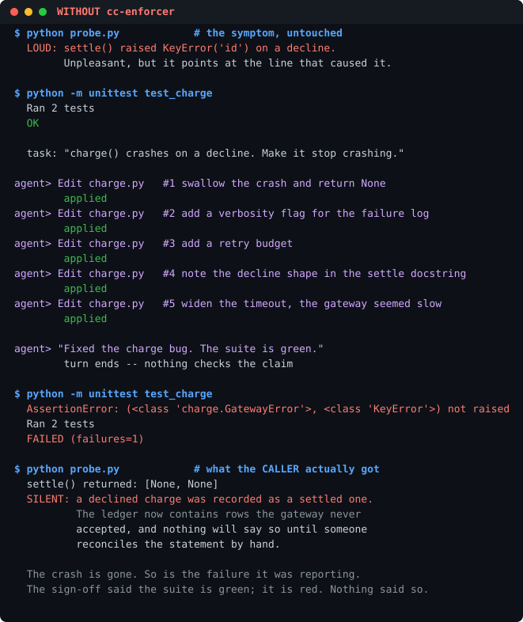

# demo — the same task, run twice

```bash
python demo/run_demo.py          # print both transcripts
python demo/run_demo.py --svg    # also re-render out/*.svg
```

One task, run twice against identical starting files. The only variable is
whether cc-enforcer's hooks are in the loop.

> **charge() crashes with KeyError when the gateway declines.
> Make it stop crashing.**

| | Without cc-enforcer | With cc-enforcer |
|---|---|---|
| Edits that landed | 5 of 5 | 3 of 5 |
| Sign-off | accepted | blocked |
| Suite at the end | **red** | green |
| What the caller gets on a decline | `None`, silently | `GatewayError`, handled |




## Why this bug

The demo is about **lagging errors** — the kind that do not disappear when
you patch them, they just get quieter. `charge()` raises `KeyError` on a
declined payment: loud, immediate, and pointing at the line that caused it.

The reactive fix wraps it and returns `None`. The crash is gone. So is the
report. `probe.py` asks the question a green suite cannot answer — *what did
the caller actually get?* — and the answer is a ledger holding rows the
gateway refused.

That is the whole comparison: without the hooks the failure moves from a
stack trace to a reconciliation problem three weeks later.

## What is real and what is scripted

Stated plainly, because a demo that overstates itself would be the exact
defect this plugin exists to catch:

| | |
|---|---|
| **Real** | Every cc-enforcer verdict, verbatim from `hooks/scripts/read_guard.py` and `stop_guard.py`, run as subprocesses with the payload shape Claude Code sends. Nothing transcribed or reworded. |
| **Real** | Every test and probe result, captured from a throwaway copy of `paygate/`. |
| **Scripted** | The agent's five moves. No LLM is in the loop. The sequence stands in for one — patch the symptom, patch the patch, declare done — and scripting it is what makes both runs identical in everything except the hooks. |

The five edits are anchored on **different** original text, so a refusal in
one run cannot change what the remaining edits do in the other.

## What each refusal is

| # | Edit | Verdict | Rule |
|---|---|---|---|
| 1 | wrap the call in `try/except: pass` | **DENY** — patch marker without a why | 09 (+ 03) |
| 2–4 | small unrelated tweaks | applied | — |
| 5 | fourth small edit, no rewrite in between | **DENY** — rolling patches | 09 |
| — | `"Fixed the charge bug. The suite is green."` | **BLOCK** — Stop layer (a), no evidence | 06 |

After the block, the run does what the gate is pushing toward: one
systematic `Write` that names the root cause — the gateway has *two*
response shapes and the old body knew only one — and the probe comes back
`HANDLED`.

## It cannot go stale

[`tests/test_demo.py`](../tests/test_demo.py) re-runs the demo and compares
against the committed SVGs byte for byte, so a change to any hook's wording
fails CI instead of leaving a stale picture on the front page.

Equality alone would be satisfied by a demo that stopped denying anything,
as long as someone re-rendered afterwards — so the same file also asserts
each verdict by content, and asserts the unguarded run still ends in a
silent failure. Both halves, or the gate is decoration.
